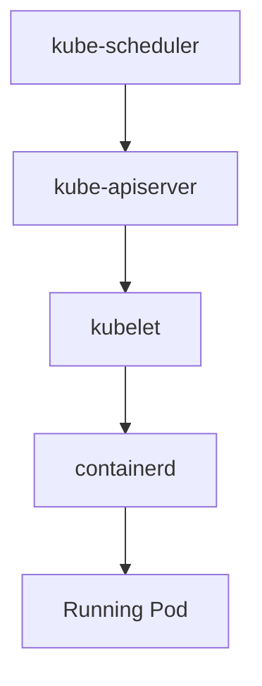
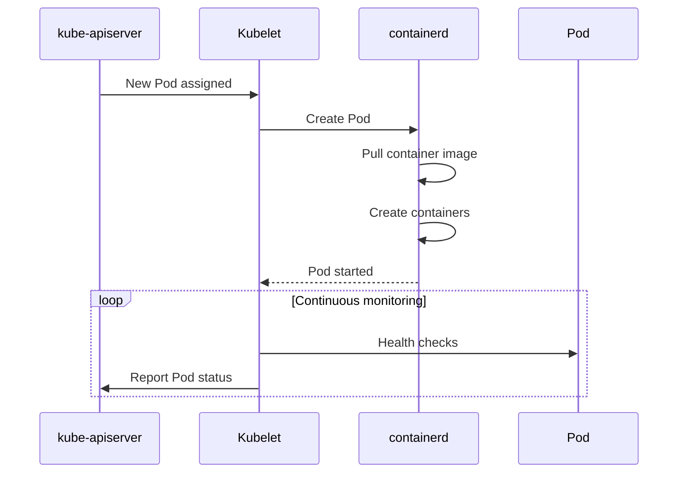
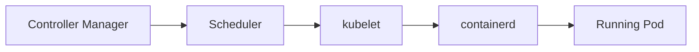

# kubelet

← [Kubernetes Architecture](./architecture.md)

---

# What you will learn

After reading this page you should be able to explain:

- What the kubelet is.
- Why every Worker Node runs a kubelet.
- How the kubelet communicates with the Control Plane.
- How Pods are started on a Worker Node.
- What responsibilities belong to the kubelet.
- What happens if the kubelet becomes unavailable.

---

# What is kubelet?

The **kubelet** is an agent that runs on every Worker Node.

Its primary responsibility is to ensure that all Pods assigned to its Node are running as expected.

Unlike the Scheduler, the kubelet does not decide where Pods should run.

Instead, it executes the decisions made by the Control Plane.

---

# Why does Kubernetes need kubelet?

After the Scheduler assigns a Pod to a Worker Node, Kubernetes still needs a component that can actually start and manage the Pod.

This is the responsibility of the kubelet.

The kubelet continuously watches the Kubernetes API for Pods assigned to its Node.

Whenever a new Pod is assigned, the kubelet asks the container runtime to create and start the required containers.

---

# Pod Startup Flow

---

# Responsibilities

The kubelet is responsible for:

- watching Pods assigned to its Worker Node;
- communicating with the container runtime (containerd);
- creating and starting Pods;
- monitoring Pod health;
- restarting failed containers according to the Pod restart policy;
- reporting Pod and Node status back to the Control Plane.

---

# Pod Lifecycle

---

# What the kubelet does NOT do

The kubelet does not:

- decide where Pods should run;
- schedule Pods;
- communicate directly with etcd;
- create Deployment objects;
- perform load balancing.

These responsibilities belong to other Kubernetes components.

---

# Example

A new Pod is scheduled to **worker-2**.

The kubelet running on **worker-2** detects the new Pod assignment.

It asks **containerd** to:

- pull the container image (if necessary);
- create the Pod sandbox;
- create the containers;
- start the containers.

Once the Pod is running, the kubelet continuously monitors its health and reports its status to the Control Plane.

---

# What happens if the kubelet becomes unavailable?

Existing containers usually continue running.

However:

- new Pods cannot be started on that Worker Node;
- Pod status is no longer updated;
- failed containers are not restarted;
- the Node is eventually marked as **NotReady** by the Control Plane.

---

## kubelet in the Kubernetes Architecture

---

# Summary

- Every Worker Node runs a kubelet.
- The kubelet is responsible for the lifecycle of Pods on its Node.
- It communicates with the container runtime to create and manage containers.
- It continuously monitors Pods and reports their status back to the Control Plane.
- The kubelet executes decisions made by the Scheduler but never makes scheduling decisions itself.