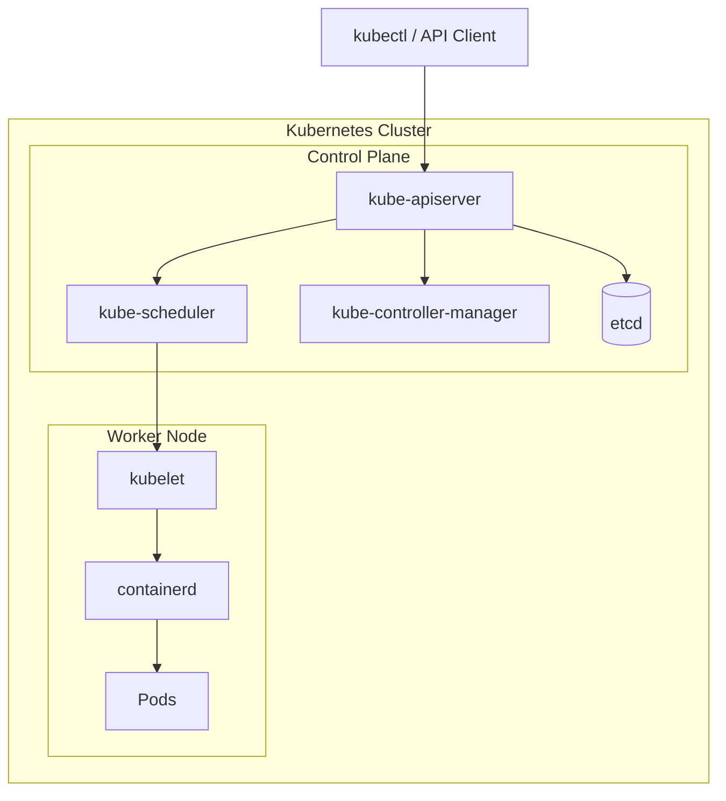

# Kubernetes Architecture

## What you will learn

After reading this page you should be able to explain:

- What a Kubernetes Cluster consists of.
- Which components belong to the Control Plane.
- Which components run on Worker Nodes.
- How a request flows through Kubernetes.
- How Kubernetes creates and manages Pods.

---

# High-Level Architecture




## Control Plane

The Control Plane is the brain of the Kubernetes cluster.

It receives all API requests, stores the desired state of the cluster, schedules workloads and continuously ensures that the actual state matches the desired state.

Main components:

| Component | Responsibility |
|-----------|----------------|
| kube-apiserver | Entry point to the Kubernetes API |
| etcd | Stores the desired state of the cluster |
| kube-scheduler | Selects the most suitable Node for new Pods |
| kube-controller-manager | Continuously reconciles the current and desired state |

> **Note**
>
> Each Control Plane component will be explained in detail in its own document.

## Worker Node

The Control Plane is the brain of the Kubernetes cluster.

It receives all API requests, stores the desired state of the cluster, schedules workloads and continuously ensures that the actual state matches the desired state.

Main components:

| Component | Responsibility |
|-----------|----------------|
| kube-apiserver | Entry point to the Kubernetes API |
| etcd | Stores the desired state of the cluster |
| kube-scheduler | Selects the most suitable Node for new Pods |
| kube-controller-manager | Continuously reconciles the current and desired state |

> **Note**
>
> Each Control Plane component will be explained in detail in its own document.

## Platform Services

K3s installs several platform services automatically.

Read more:

- [Kubernetes System Components](./kubernetes-system-components.md)

# Summary

The Kubernetes architecture consists of two major parts:

- **Control Plane** — manages the cluster.
- **Worker Nodes** — run application workloads.

Every request follows the same high-level flow:

```text
kubectl
        │
        ▼
kube-apiserver
        │
        ▼
etcd
        │
        ▼
Controller Manager
        │
        ▼
Scheduler
        │
        ▼
kubelet
        │
        ▼
containerd
        │
        ▼
Pods
```

Understanding this request flow is the foundation for understanding Kubernetes.