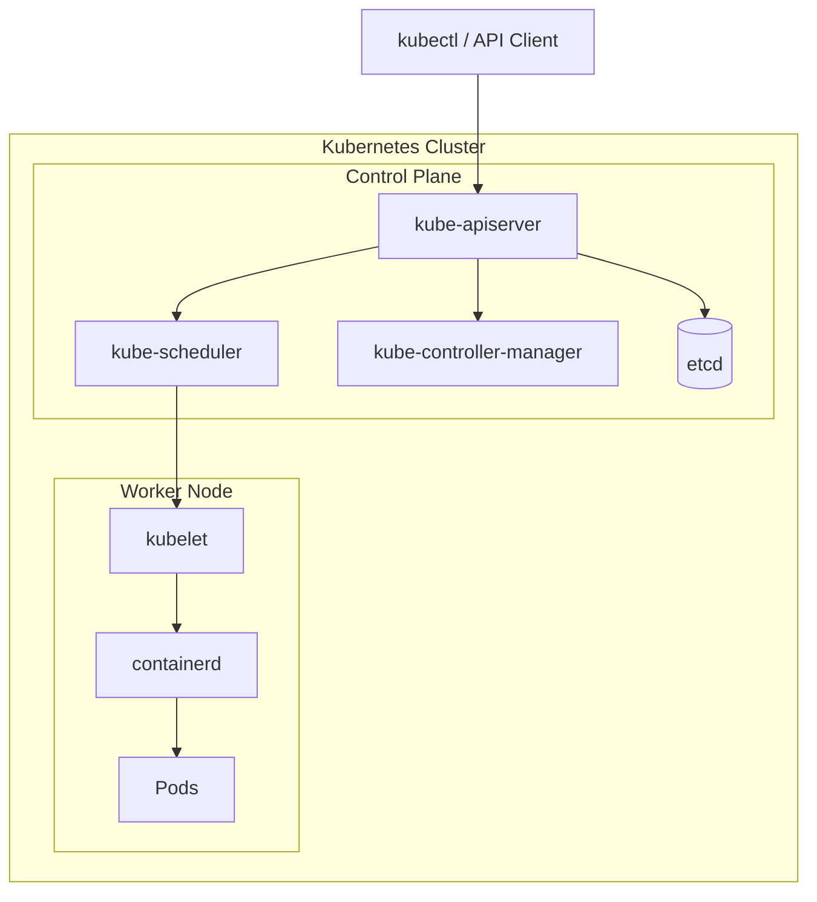

# Kubernetes Architecture

## What you will learn

After reading this page you should be able to explain:

- What a Kubernetes Cluster consists of.
- Which components belong to the Control Plane.
- Which components run on Worker Nodes.
- How a request flows through Kubernetes.
- How Kubernetes creates and manages Pods.

---

# High-Level Architecture

## Control Plane

- kube-apiserver
- etcd
- kube-scheduler
- kube-controller-manager

## Worker Node

- kubelet
- containerd

## Platform Services

K3s installs several platform services automatically.

Read more:

- [Kubernetes System Components](./kubernetes-system-components.md)