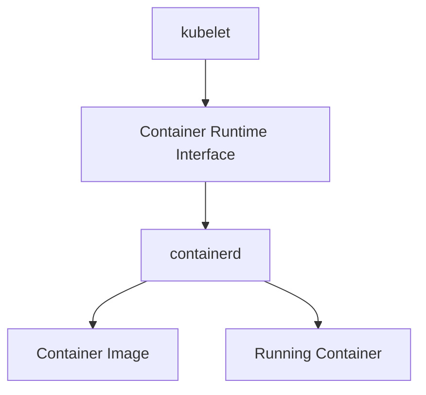

# containerd

← [Kubernetes Architecture](./architecture.md)

---

# What you will learn

After reading this page you should be able to explain:

- What a container runtime is.
- Why Kubernetes needs a container runtime.
- What responsibilities belong to containerd.
- How kubelet communicates with containerd.
- What CRI is.
- What happens if containerd becomes unavailable.

---

# What is containerd?

containerd is a container runtime responsible for creating and managing containers.

Unlike Kubernetes components, containerd does not understand Deployments, Services or Pods.

Its responsibility begins when the kubelet asks it to create a Pod.

---

# Why does Kubernetes need containerd?

The kubelet knows that a Pod should run.

However, it does not know how to create Linux containers.

Instead, it delegates this responsibility to the container runtime.

---

# Architecture

---

# Responsibilities

containerd is responsible for:

- pulling container images;
- storing images locally;
- creating Pod sandboxes;
- creating Linux namespaces;
- configuring cgroups;
- starting containers;
- stopping containers;
- removing containers.

---

# What containerd does NOT do

containerd does not:

- schedule Pods;
- communicate with etcd;
- manage Deployments;
- manage Services;
- make scheduling decisions.

Those responsibilities belong to Kubernetes.

---

# What happens if containerd becomes unavailable?

Running containers usually continue executing.

However:

- new containers cannot be created;
- failed containers cannot be restarted;
- image pulls fail;
- the kubelet cannot create new Pods.

---

# Summary

- containerd is the container runtime used by Kubernetes.
- It creates and manages Linux containers.
- It communicates with the kubelet through the Container Runtime Interface (CRI).
- It has no knowledge of Kubernetes resources such as Deployments or Services.