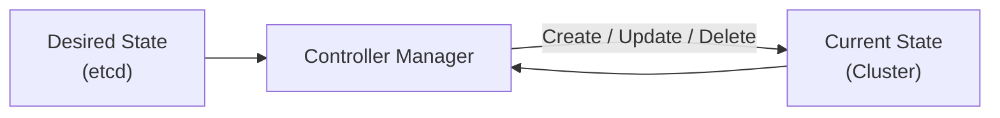
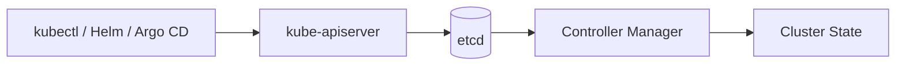

# etcd

← [Kubernetes Architecture](./architecture.md)

---

# What you will learn

After reading this page you should be able to explain:

- Why Kubernetes needs etcd.
- What information is stored in etcd.
- Why clients never communicate with etcd directly.
- Why etcd is called the single source of truth.
- What happens if etcd becomes unavailable.

---

# What is etcd?

**etcd** is a distributed key-value database used by Kubernetes to store the cluster state.

It is the **single source of truth** for the entire cluster.

Every Kubernetes object is ultimately stored in etcd.

The API Server is the only component that communicates directly with etcd.

---

# Why does Kubernetes need etcd?

Imagine that the API Server receives a request:

```bash
kubectl apply -f deployment.yaml
```

After validating the request, Kubernetes must store it somewhere.

If the information were kept only in memory, it would disappear after restarting the API Server.

Instead, Kubernetes stores the cluster state in etcd.

This allows the cluster to recover its state even after components restart.

---

# What does etcd store?

etcd stores Kubernetes objects and their state.

Examples include:

- Deployments
- Pods
- Services
- ConfigMaps
- Secrets
- Namespaces
- PersistentVolumeClaims
- Nodes

Each object is stored as structured data inside the database.

For example, a Deployment with three replicas is stored as a Kubernetes object describing the desired state of that Deployment.

---

# What does etcd NOT store?

Although etcd stores Kubernetes objects, it does **not** store application data.

Examples of information that is **not** stored in etcd:

- Container images
- Application logs
- PostgreSQL databases
- Files stored on PersistentVolumes
- CPU and memory metrics

Those are managed by other Kubernetes components.

---

# Single Source of Truth

The cluster always trusts the information stored in etcd.

If etcd contains:

```yaml
replicas: 3
```

Kubernetes assumes that three Pods should exist.

If only two Pods are currently running, Kubernetes will attempt to restore the missing Pod until the current state matches the desired state.



---

# Why doesn't Kubernetes access etcd directly?

Clients never communicate directly with etcd.

Instead, every request passes through the API Server.

This allows Kubernetes to:

- authenticate users;
- authorize requests using RBAC;
- validate Kubernetes objects;
- execute Admission Controllers;
- protect the integrity of the cluster state.

---

# Data Flow



---

# Example

A user creates a Deployment.

```bash
kubectl apply -f deployment.yaml
```

The API Server validates the request and stores the Deployment object inside etcd.

At this point, no Pods have been created yet.

The Controller Manager later reads the desired state from etcd and starts the reconciliation process.

---

# What happens if etcd becomes unavailable?

Without etcd, Kubernetes loses access to its stored cluster state.

As a result:

- new objects cannot be created;
- existing objects cannot be updated;
- the Control Plane cannot reconcile the cluster state.

Already running Pods may continue serving traffic, but Kubernetes can no longer reliably manage the cluster.

---

# Summary

- etcd is the database of Kubernetes.
- It stores Kubernetes objects, not application data.
- etcd is the single source of truth for the cluster.
- Only the API Server communicates directly with etcd.
- Other Control Plane components read the desired state stored in etcd.