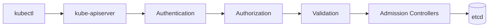
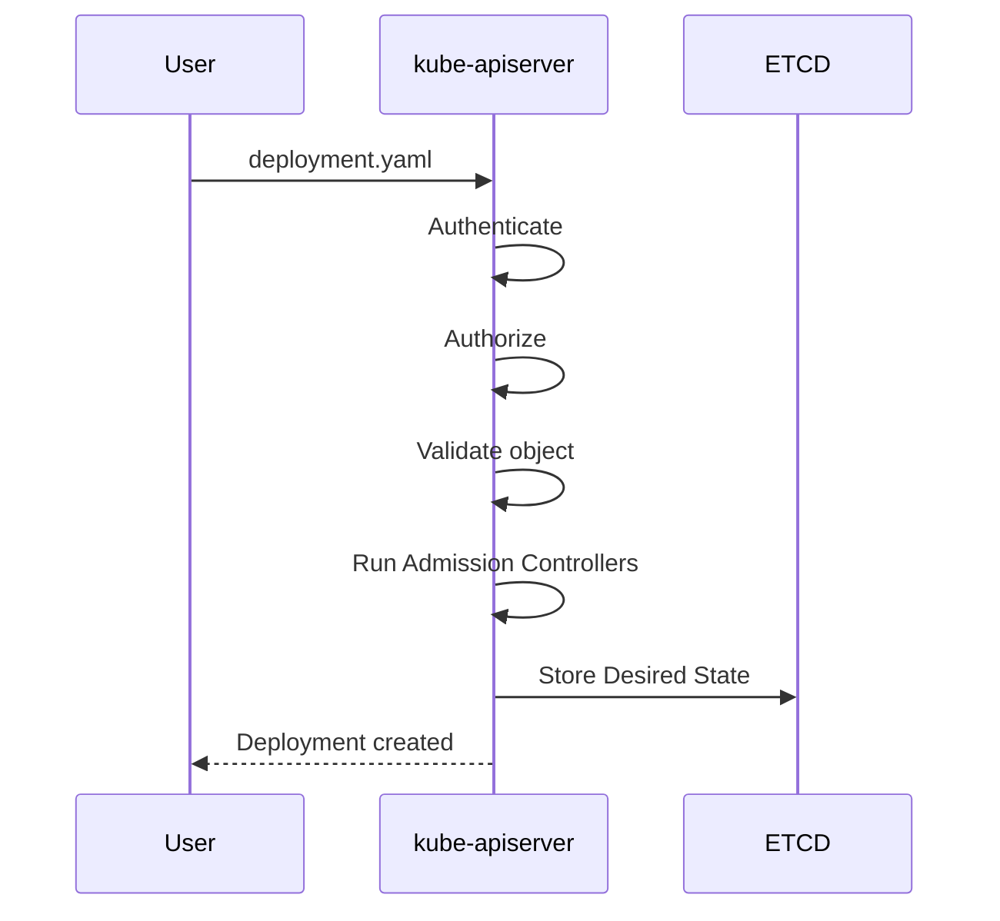

# kube-apiserver

← [Kubernetes Architecture](architecture.md)

---

# What you will learn

After reading this page you should be able to explain:

- Why Kubernetes uses an API Server.
- Why clients never communicate directly with etcd.
- What happens after running `kubectl apply`.
- Which responsibilities belong to the API Server.
- How to inspect the API Server in a cluster.

---

# What is kube-apiserver?

The **kube-apiserver** is the central entry point of the Kubernetes Control Plane.

Every request to the cluster goes through the API Server.

Whether you use:

- kubectl
- Helm
- Argo CD
- Kubernetes Dashboard
- Operators
- Controllers

they all communicate with the Kubernetes API.

The API Server is the only component allowed to read from and write to **etcd**.

---

# Why does Kubernetes need an API Server?

It may seem simpler to let every component communicate directly with etcd.

However, this would introduce several problems:

- No authentication
- No authorization (RBAC)
- No object validation
- No centralized API
- No auditing
- No version compatibility

Instead, Kubernetes uses a single entry point that validates every request before the cluster state is changed.

---

# Request Flow



---

# Responsibilities

The API Server performs much more than simply forwarding requests.

Its responsibilities include:

- authenticating clients;
- authorizing requests using RBAC;
- validating Kubernetes objects;
- executing Admission Controllers;
- reading and writing the desired state to etcd;
- exposing the Kubernetes REST API.

---

# Example

When a user executes:

```bash
kubectl apply -f deployment.yaml
```

the following happens:



Notice that no Pod has been created yet.

The API Server only stores the desired state.

Other Control Plane components will later create the Pods.

---

# Desired State

The API Server stores the desired state of the cluster.

Example:

```yaml
replicas: 3
```

This does **not** mean:

> Start three Pods.

Instead it means:

> The cluster should always have three running Pods.

Maintaining this desired state is the responsibility of other Kubernetes controllers.

---

# What happens if the API Server becomes unavailable?

Existing Pods continue running because they execute on Worker Nodes.

However:

- kubectl stops working;
- new Deployments cannot be created;
- cluster changes cannot be stored;
- controllers cannot update the desired state.

The cluster continues running existing workloads but cannot be managed until the API Server becomes available again.

---

# Inspecting the API Server

View the running Pod:

```bash
kubectl get pods -n kube-system
```

Example:

```text
kube-apiserver-control-plane
```

Check cluster health:

```bash
kubectl cluster-info
```

View available API resources:

```bash
kubectl api-resources
```

View API versions:

```bash
kubectl api-versions
```

---

# Summary

- kube-apiserver is the single entry point to Kubernetes.
- Every request passes through the API Server.
- Only the API Server communicates directly with etcd.
- The API Server validates and authorizes every request.
- It stores the desired state but does not create Pods itself.