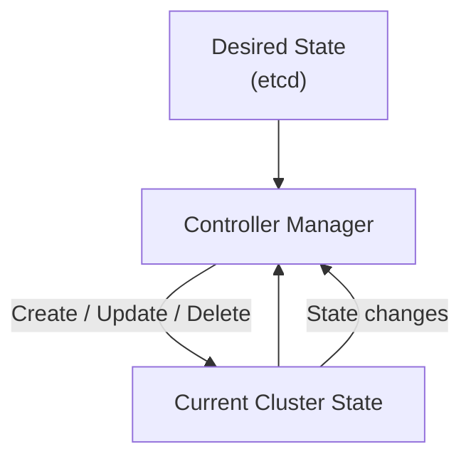

# kube-controller-manager

← [Kubernetes Architecture](./architecture.md)

---

# What you will learn

- Why Kubernetes needs controllers.
- What reconciliation means.
- How the Controller Manager works.
- Why Controllers do not run containers.
- What happens if the Controller Manager stops.

---

# What is kube-controller-manager?

The kube-controller-manager continuously watches the cluster state and compares it with the desired state stored in etcd.

Whenever a difference is detected, it creates or updates Kubernetes objects until both states match.

This process is called reconciliation.

---

# Reconciliation Loop

---

# Responsibilities

The Controller Manager does not run Pods.

Instead, it creates, updates or deletes Kubernetes objects.

Examples include:

- Deployment Controller
- ReplicaSet Controller
- Node Controller
- Namespace Controller
- Job Controller
- ServiceAccount Controller

Each controller is responsible for a specific Kubernetes resource.

---

# Example

Desired State:

replicas: 3

Current State:

2 Pods

↓

Controller Manager creates a new Pod object.

↓

Scheduler selects a Node.

↓

kubelet starts the Pod.

---

# What happens if kube-controller-manager becomes unavailable?

- Existing Pods continue running.
- Failed Pods are not recreated.
- Scaling stops.
- Desired State is no longer reconciled.

---

# Summary

- Controller Manager continuously compares desired and current state.
- It creates Kubernetes objects but does not run containers.
- Reconciliation is the core principle behind Kubernetes self-healing.