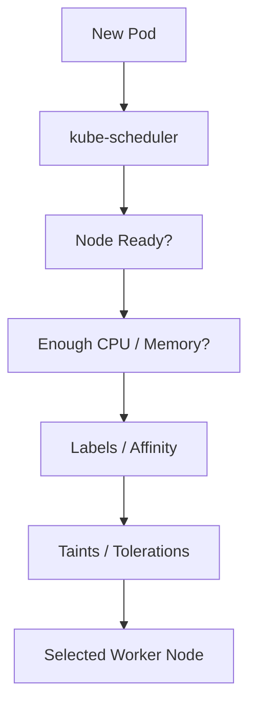
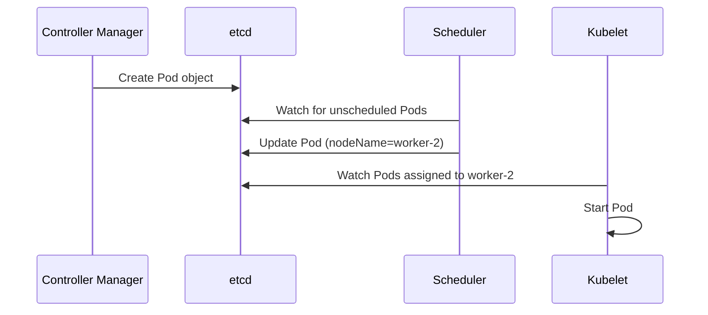

# kube-scheduler

← [Kubernetes Architecture](./architecture.md)

---

# What you will learn

After reading this page you should be able to explain:

- Why Kubernetes needs a Scheduler.
- How the Scheduler selects a Worker Node.
- Which factors influence scheduling decisions.
- What the Scheduler does after selecting a Node.
- What happens if the Scheduler becomes unavailable.

---

# What is kube-scheduler?

The **kube-scheduler** is a Control Plane component responsible for assigning newly created Pods to Worker Nodes.

The Scheduler does **not** create Pods and does **not** start containers.

Its only responsibility is to decide **where a Pod should run**.

---

# Why does Kubernetes need a Scheduler?

When the Controller Manager creates a new Pod object, the Pod is not assigned to any Node.

At this stage, Kubernetes knows **what** should run, but it does not yet know **where** it should run.

The Scheduler continuously watches for Pods that have not yet been assigned to a Node and selects the most suitable Worker Node.

---

# Scheduling Process



---

# How does the Scheduler choose a Node?

The Scheduler evaluates every available Worker Node before making a decision.

Some of the most important scheduling criteria are:

- Node is in the **Ready** state.
- Enough CPU resources are available.
- Enough memory is available.
- Node labels match the Pod requirements.
- Affinity and anti-affinity rules are satisfied.
- Taints and tolerations are respected.
- Resource requests defined in the Pod can be fulfilled.

The Scheduler filters unsuitable Nodes and then selects the best candidate from the remaining ones.

---

# What happens after a Node is selected?

After selecting a Worker Node, the Scheduler updates the Pod specification.

For example:

Before scheduling:

```yaml
spec:
```

After scheduling:

```yaml
spec:
  nodeName: worker-2
```

At this point, the Scheduler has completed its work.

The actual Pod will later be started by the **kubelet** running on the selected Worker Node.

---

# What the Scheduler does NOT do

The Scheduler does not:

- create Pods;
- start containers;
- download container images;
- monitor running applications;
- communicate directly with containerd.

These responsibilities belong to other Kubernetes components.

---

# Example

A Deployment requests three replicas.

The Controller Manager creates three Pod objects.

Each Pod has no assigned Node.

The Scheduler evaluates all available Worker Nodes and assigns each Pod to the most appropriate Node.

The kubelet on that Node later creates and starts the containers.

---

# What happens if the Scheduler becomes unavailable?

Existing Pods continue running normally.

However:

- new Pods cannot be assigned to Worker Nodes;
- Pending Pods remain in the Pending state;
- scaling operations cannot complete;
- failed Pods cannot be rescheduled.

The cluster continues serving existing workloads but cannot schedule new ones.

---



# Summary

- The Scheduler decides where Pods should run.
- It does not create Pods or start containers.
- It evaluates Worker Nodes using scheduling rules.
- After selecting a Node, it assigns the Pod by updating its `nodeName`.
- The kubelet is responsible for starting the Pod on the selected Node.