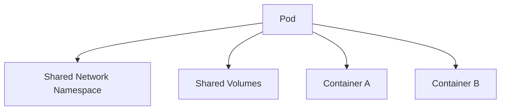
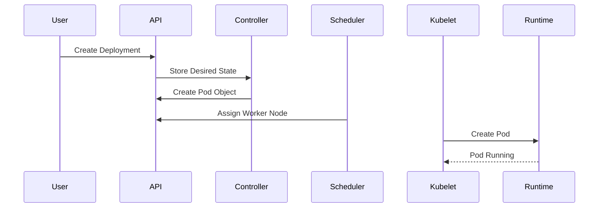

# Pod

← [Kubernetes Architecture](./architecture.md)

---

# What you will learn

After reading this page you should be able to explain:

- What a Pod is.
- Why Kubernetes uses Pods instead of containers.
- What components make up a Pod.
- How Pods are created.
- Why Pods are considered ephemeral.
- The relationship between Pods and containers.

---

# What is a Pod?

A **Pod** is the smallest deployable unit in Kubernetes.

A Pod is **not** a container.

Instead, it is a Kubernetes object that defines one or more containers which should run together on the same Worker Node.

Every application running in Kubernetes runs inside a Pod.

---

# Why does Kubernetes use Pods?

Kubernetes does not manage containers directly.

Instead, it manages Pods.

This provides additional capabilities such as:

- shared networking;
- shared storage volumes;
- lifecycle management;
- health monitoring;
- scheduling as a single unit.

Containers inside the same Pod are always scheduled together.

---

# Pod Architecture

---

# Pod Lifecycle

---

# Pod Components

A Pod may contain:

- one or more containers;
- one IP address shared by all containers;
- one network namespace;
- shared storage volumes;
- metadata (labels, annotations, namespace).

Containers inside the same Pod communicate through **localhost** because they share the same network namespace.

---

# Single-container vs Multi-container Pods

Most Pods contain only one container.

However, Kubernetes also supports multiple tightly coupled containers inside the same Pod.

Common examples include:

- application + logging sidecar;
- application + proxy (Envoy);
- application + metrics exporter.

All containers share the same lifecycle and are scheduled together.

---

# Are Pods permanent?

No.

Pods are **ephemeral**.

If a Pod fails, Kubernetes usually creates a new Pod instead of repairing the existing one.

For this reason, application data should not be stored inside the Pod filesystem.

Persistent data should be stored on Persistent Volumes.

---

# What happens if a Pod crashes?

The kubelet monitors the Pod.

Depending on the restart policy:

- failed containers may be restarted;
- the Pod may be recreated by a higher-level controller such as a Deployment.

This behavior enables Kubernetes self-healing.

---

# Summary

- A Pod is the smallest deployable unit in Kubernetes.
- A Pod is not the same as a container.
- A Pod may contain one or multiple containers.
- Containers inside a Pod share networking and storage.
- Pods are ephemeral and should not store persistent application data.